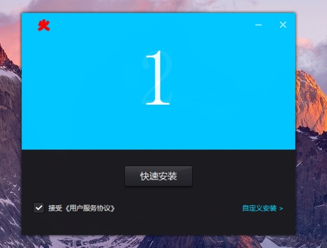

# 当必火🔥——Windows 平台的下载器

🚀 当必火🔥——让程序下载和安装变得简单！



## 特点:

- Windows C++ 原生代码（std:c++14）
- 超小体积——Release 版本只有 400kb 左右
- 使用 WTL，不依赖其他库
- 只需修改一个文件，就可以编译成自己的下载器
- 自绘界面，对懂 C++ 的高度可定制
- 下载一个 Zip 文件，解压然后安装到指定目录，并创建桌面快捷方式

## 编译

Visual Studio 2022

## 使用:

代码上，只需改一个 cpp 文件，重新编译即可。

编辑 src/Global.cpp。如果用 VC++ 打开，查看 Source Files/Global.cpp。

```c++
/// <configuration>
/// Set the following string and then compile

// Query zip download link
std::string CGlobal::downloadurl_ = "http://127.0.0.1:5001/download-url";
// directory name
std::string CGlobal::appDirName_ = "MyeXeAppDir";
// Exe file name such as eXeScope.exe or a relative path such as bin\\eXeScope.exe
std::string CGlobal::appname_ = "eXeScope.exe";
// shortcut file name
std::string CGlobal::shortcutname_ = "eXeScope";
// Link to open after installation
std::string CGlobal::openurl_ = "https://github.com/sinajia/Downloader";

/// </configuration>
```

需要修改上面五个变量。它们代表的意义如下：

downloadurl_，Get 请求地址。获取真正的 Zip 文件地址。

appDirName_，代表程序安装的文件夹的名称，这个文件夹由本下载器自动创建。

appname_，exe 文件的名称。例如 eXeScope.exe 或者 bin\\eXeScope.exe。

shortcutname_，桌面快捷方式的名称。

openurl_，可选。安装过程中，自动调用系统默认浏览器打开的网址，可以是空字符串""。如果为空字符串，则没有打开动作。

使用本下载器，需要有一个服务器端，必须实现上述的 Get 请求。以下代码是用 node.js 写的示例代码：

```js
const express = require('express')
const app = express()

app.get('/download-url', (req, res) => {
  res.json({
    downloadUrl: 'http://xxxx.com/zipfile.zip',
  })
})

const server = require('http').createServer(app)

server.listen(5001, '0.0.0.0', function (err) {
  console.log('running')
})
```

本下载器会自动解析这个 Get 请求返回的 Json 字符串。字段 downloadUrl 是必须的，表示真正的 Zip 文件的地址。Zip 文件就是程序的压缩包。

关于程序压缩包，可以参看 example\eXeScope.zip。

你还应该替换 App.ico，这个文件在 src\res。将 App.ico 替换为你自己程序的 ico 文件。当然，文件名必须还是 App.ico。

除此之外，你需要将 src\res\png 里面 1.png, 2.png, 3.png, 4.png, 5.png, 6.png 替换一下。这六张 png 图片是六张轮播图，替换成自己的。要求图片尺寸都是 480 × 240，png 格式。

做完这些，重新编译，然后启动！

## Star 一下

本程序的创作耗费了很多精力，请动动发财的小手点个 Star ~~~///(^v^)\\\~~~

## 赞助

本程序的创作耗费了我很多时间和精力，如果也帮到了你，请动动发财的小手，支持一下，让我更有动力更新 ❤️

USDT(TRC20)

TYWsj6oBb1zqkhMvYhXBuFYJD21dVWzXFL
